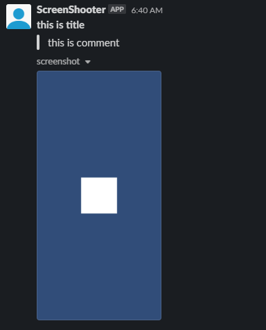

# unity-screen-shooter
Share unity screenshots to messenger directly

## Requirements

### Slack
Bot User OAuth Access Token  
Access rights
> chat:write  
> files:write  
> incoming-webhook  

### Discord
need implementing

## Quickstarts

Setup (Saved at Assets/Editor/Util/ScreenShooter/Resources/Setting)

Press capture and send button

Check in Slack channel

